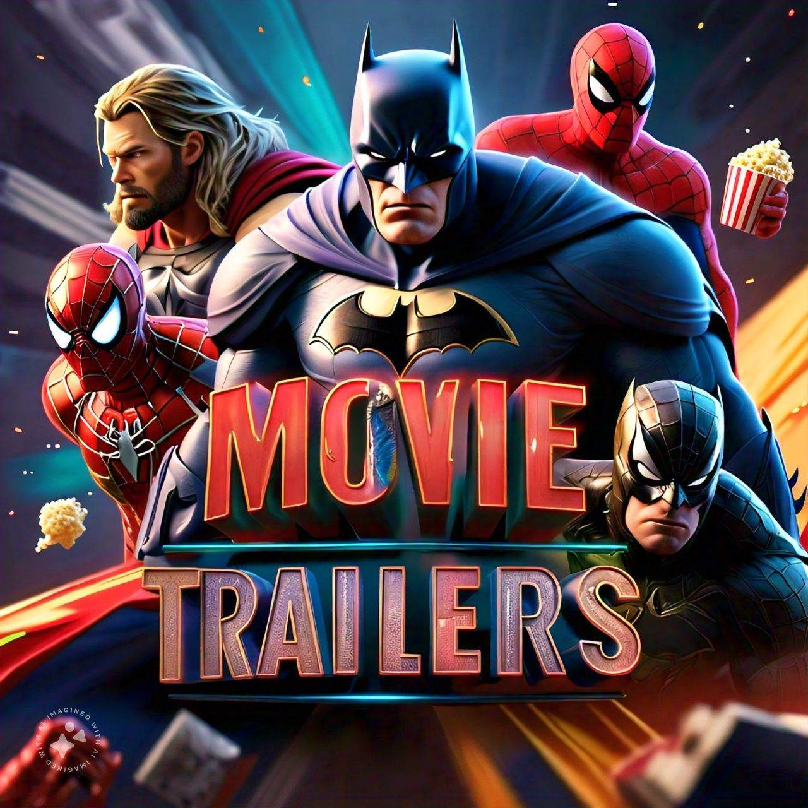

<p align="center">
    <a href="https://www.linkedin.com/in/edna-leiden-oliver-dupont-305680126/"  target="_blank"></a>
</p>

#  📁 *Project created for view trailers movie*
> This project is based on learning takes technical skills to another level.
# Java Spring API-REST - There We Go!!  📽️  🎞️ 🎬 🍿 🍿 🍿 🛋️
- Manejo de las siguientes capas
    - *controller*
    - *entity*
    - *exceptions*
    - *repository*
    - *services*
    - *architerture MVC*

- librerias
    - maven
    - lombok
    - JDB API
    - JPA
    - MYSQL
    - Thymeleaf

## Que requieres para clonar
    jdk 17
- para revisar si tienes instalado coloca el siguiente comando

    - jdk 17
```bash
java --version
```
- necesitas maven version superior > 3.0.3
```bash
mvn --version
```
- puerto por el que corre el servicio
```bash
8080
```
- motor de base de datos mysql
```bash
name data base : pelis
```
- clona el repo 😉


 
- **¡Saludos!**
